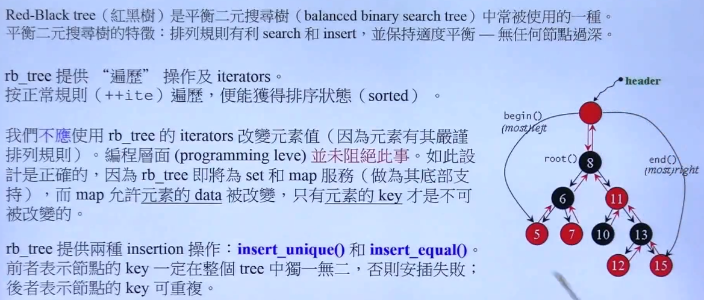

## Leetcode210

这道题 拓扑排序

从一张有向图输出拓扑排序的两种方法：

栈方法：所以从一点开始，深度向下，走到没有子节点的地方时，把该节点放到栈中。（所以这个地方如何判断是否有环：在遍历的时候 ，会给正在被遍历的节点加上标志位，一旦又访问到它，则说明有环），然后倒回上一节点接着深度，最后返回。然后再选一个未在栈中的节点执行同样步骤。把栈输出就是结果

队列方法，先遍历，将入度为零的节点放入队列中。取出队列中的第一个值，放入结果，将该节点的所有子节点的入度都减1，如果该子节点入度为0，则将该节点放入队列。（判断是否有环，一旦有环的话，则会出现队列空了，但是图中还有元素，也就是结果和节点数不相同。）

---

## Kaggle

昨天的第三课，处理类别变量的方法的最后一空：

应该处理的步骤

1. 一开始的时候就应该分成，数值型和类别型两部分
2. 对于数值型的部分，进行imputer,，同时去transform测试集
3. 对于类别型的部分，选择出需要one-hot的列，OneHotEncoder编码，然后transform
4. concat

---

## 侯杰

rb-tree

所以有一个和链表哨兵结点很类似的一个header结点指向树的根节点。

实现放在复合类中

Rb_tree和Rb_tree_impl，符合handle&body

在rbtree中，value是（key|data）的包装，在set中，value就是key。

map的value让我有点晕：

map的[]如果找到就返回，找不到就插入一个默认？？？

multimap不可使用[]做insertion

所以直接调用insert比[]快？

---

hasttable

当元素个数大于篮子的个数的时候，篮子的个数翻倍，然后重新打散所有元素

（篮子的初始个数一般选择素数，而扩充两倍的时候，也是选择两倍左右的素数）

篮子使用的结构是vector 

hash function是非常重要的。

hash-function的返回值就是hash-code