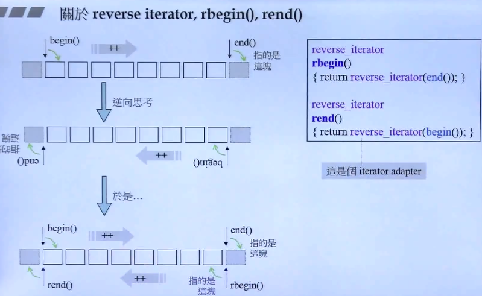
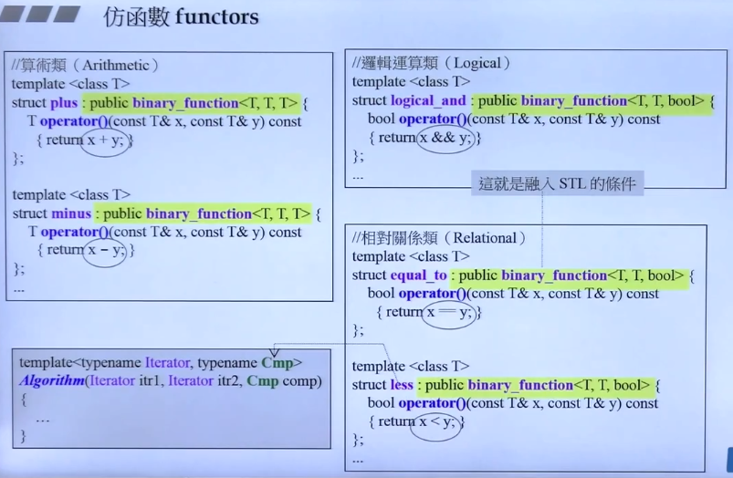
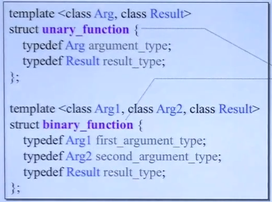
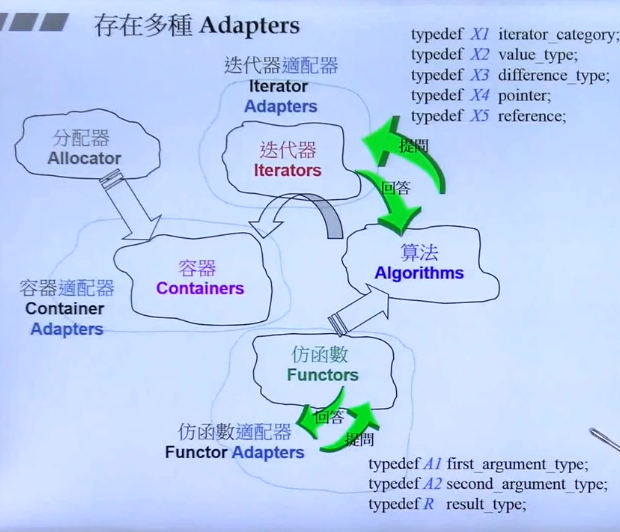
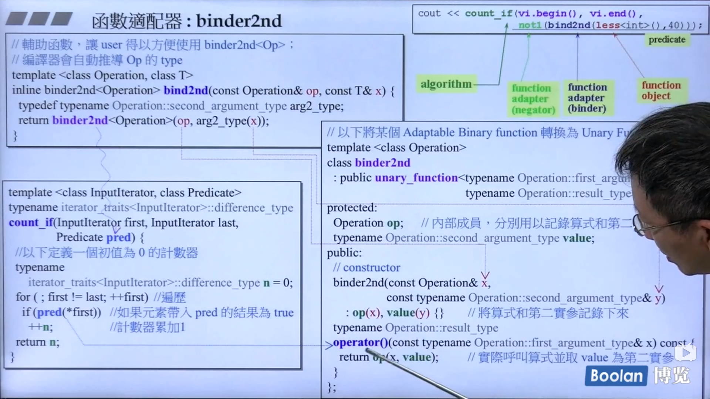

## Kaggle

Cross-validation，交叉验证

For small datasets, where extra computational burden isn't a big deal, you should run cross-validation.
For larger datasets, a single validation set is sufficient. Your code will run faster, and you may have enough data that there's little need to re-use some of it for holdout.

```python
from sklearn.model_selection import cross_val_score

# Multiply by -1 since sklearn calculates *negative* MAE
scores = -1 * cross_val_score(my_pipeline, X, y,
                              cv=5,
                              scoring='neg_mean_absolute_error')

print("MAE scores:\n", scores)
```

---

## 侯捷

泛型不会强制，但是会暗示

<template T> or <template Classname>

qsort不属于算法，因为他不是std::Aligorithm下的，符合迭代器输入的



---

### 仿函数



仿函数继承自：



factor应该选择合适的adaptor来继承，因为真正使用的时候，会有类似于萃取机一样的语法，来寻求factor中变量的信息，而合适的继承，则提供这些信息。（这里是为了融入STL的，如果只是最简单的使用，是不需要继承的）

仿函数：一个class重载了()，这样的class做出来的对象就是函数对象（仿函数）。

---

### adaptor





这个有点绕......