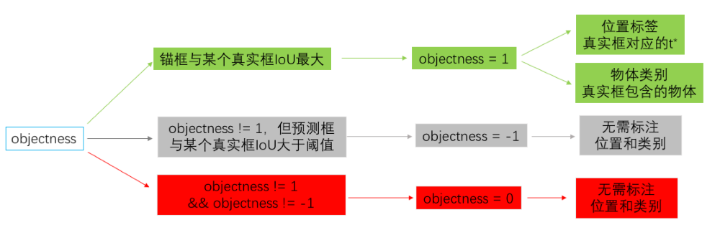
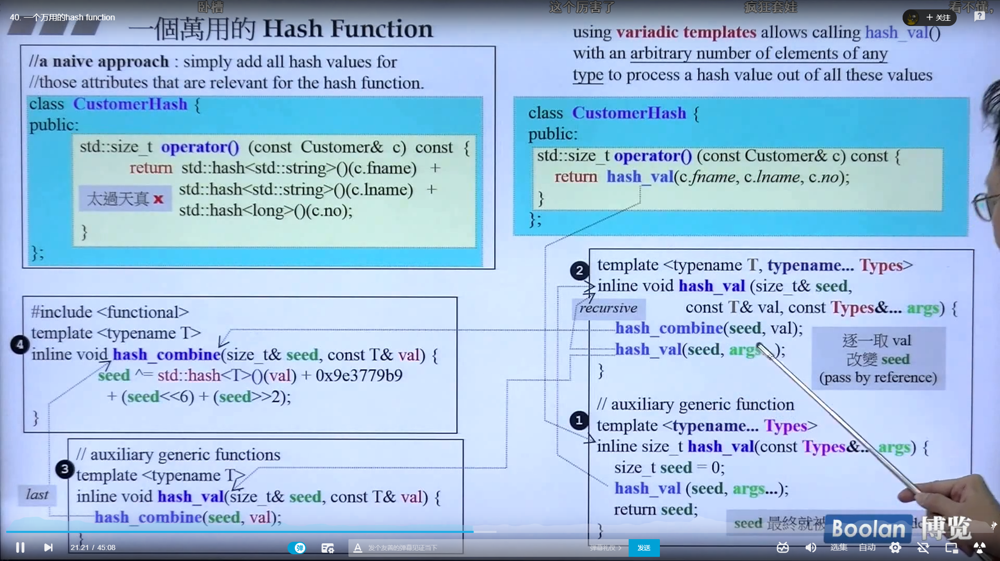
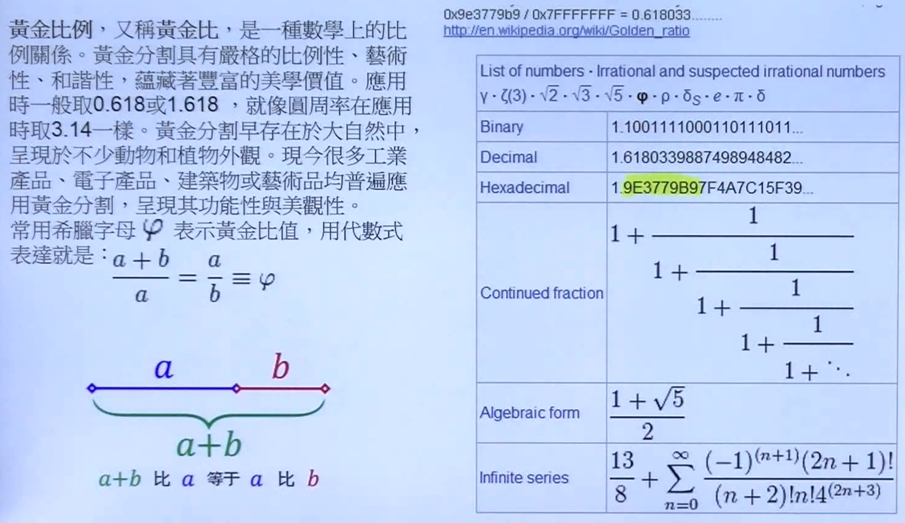

## YoLO中的loss

(在结果的地方要先算那些objectness==-1的，这是什么意思呢

就是那些有物体，但是IOU小于阈值的结果框。)

没有被标注成正样本，但是与真实框IOU较大的样本的objectness,设置成-1。这类是不参与计算损失函数的。



## 恢复训练

- 使用`model.state_dict()`获取模型参数。
- 使用`optimizer.state_dict()`获取优化器和学习率相关的参数。
- 调用`fluid.save_dygraph()`将参数保存到本地。

当加载模型时，如果模型参数文件和优化器参数文件是相同的，我们可以使用`load_dygraph`同时加载这两个文件，如下代码所示。

```python
params_dict, opt_dict = fluid.load_dygraph(params_path)
```

如果模型参数文件和优化器参数文件的名字不同，需要调用两次`load_dygraph`分别获得模型参数和优化器参数。

https://www.paddlepaddle.org.cn/tutorials/projectdetail/458054

---

## 侯捷

### 40.一个万用的hash function

CustomerHash



太屌了......


