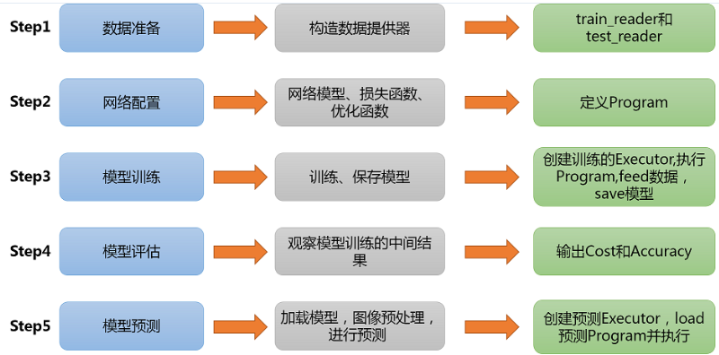
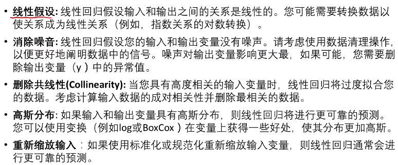
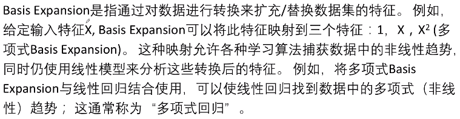
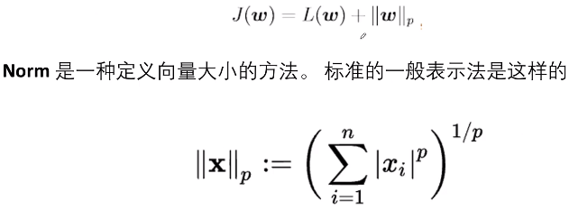
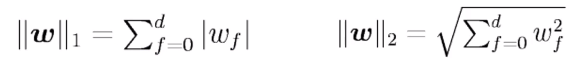

继续paddlepaddle

https://aistudio.baidu.com/aistudio/projectdetail/78960

这算是一般流程吧，刚才的几个例子都是这个流程。

emmmm，在CPU上调用GPU会直接中断哦......找了半天的原因。

https://aistudio.baidu.com/aistudio/projectdetail/499131

词向量和语义相似度

https://aistudio.baidu.com/aistudio/projectdetail/494556

海洋生物

---

## Greedy第九章

### 任务37线性回归

解析解 以及 通过最大似然来求，概率，求导，得出来的结果一样。

### 任务38基函数扩展

使用basic expansion捕捉自变量和因变量的非线性关系

理解bias-variance的关系

### 任务39 正则化

正则化：对机器学习算法的任何修改，以减少其泛化错误，但不减少其训练错误。

 ### 任务40已经看不懂了

